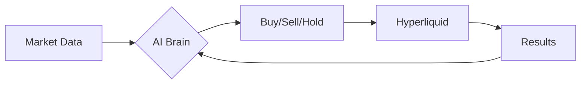

# ProjectM

An experimental trading bot that uses AI to trade perpetual futures on Hyperliquid.

## What Does It Do?

This bot watches cryptocurrency markets and makes trading decisions using a large language model. It pulls technical indicators, analyses market conditions, and places orders automatically. Everything runs in a loop at whatever interval you configure.



## Before You Start

**This is experimental software.** There are no profit guarantees. You could lose money. The code has not been audited. Only use funds you can afford to lose.

## Quick Start

1. Clone the repository
2. Copy `.env.example` to `.env`
3. Add your API keys (see below)
4. Run: `poetry run python src/main.py --assets BTC ETH --interval 1h`

## Required API Keys

| Key | Where to Get It |
|-----|-----------------|
| `TAAPI_API_KEY` | [taapi.io](https://taapi.io/) |
| `OPENROUTER_API_KEY` | [openrouter.ai](https://openrouter.ai/) |
| `HYPERLIQUID_PRIVATE_KEY` | Your Ethereum wallet private key |
| `LLM_MODEL` | Model ID from OpenRouter (e.g. `x-ai/grok-4`) |

Optional: `OPENROUTER_BASE_URL`, `OPENROUTER_REFERER`, `OPENROUTER_APP_TITLE`

## How It Works

The bot follows a simple cycle:

1. **Gather** current positions, prices, and technical indicators
2. **Ask** the LLM what to do based on market conditions
3. **Execute** any trades the LLM recommends
4. **Record** everything to a local diary
5. **Wait** for the next interval, then repeat

See [docs/ARCHITECTURE.md](docs/ARCHITECTURE.md) for technical details.

## Project Files

```
src/
  main.py              # Entry point, runs the trading loop
  config_loader.py     # Reads environment variables
  agent/
    decision_maker.py  # LLM integration and trade logic
  indicators/
    taapi_client.py    # Fetches technical indicators
  trading/
    hyperliquid_api.py # Exchange communication
```

## Running with Docker

```bash
docker build --platform linux/amd64 -t projectm .
docker run --rm -p 3000:3000 --env-file .env projectm
```

## Monitoring Endpoints

While running, the bot exposes two HTTP endpoints on port 3000:

- `/diary` shows recent trades and decisions
- `/logs` streams the raw LLM conversation logs

Change the port with `API_PORT` in your `.env` file.

## Technical Indicators

The LLM can request any indicator from TAAPI during its decision process. Common ones include EMA, RSI, MACD, Bollinger Bands, and ATR. See the [TAAPI documentation](https://taapi.io/indicators/) for the full list.

## Cloud Deployment (EigenCloud)

For running in a Trusted Execution Environment:

**Setup:**
```bash
# Install CLI
curl -fsSL https://eigenx-scripts.s3.us-east-1.amazonaws.com/install-eigenx.sh | bash

# Authenticate
docker login
eigenx auth login
```

**Deploy:**
```bash
eigenx app deploy
```

**Monitor:**
```bash
eigenx app logs --watch
```

You need a whitelisted wallet and Sepolia ETH. Apply at [onboarding.eigencloud.xyz](https://onboarding.eigencloud.xyz).

## Licence

MIT
